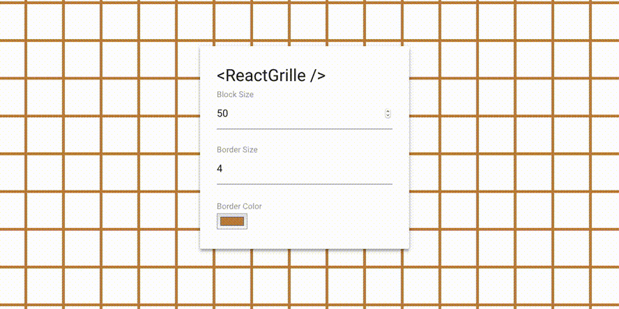

## Features

 - **Only 2.48KB** (that's 1.08KB gzipped!).
 - Only an single `<div />` node is rendered.
 - Grid is built with CSS using [`linear-gradient`](https://caniuse.com/#search=linear).
 - Control block and border size!

## Installation

  - `npm install react-grille --save`

    or

  - `yarn add react-grille`

## Usage

```js
import React from 'react'
import Grille from 'react-grille'

const Demo = () => (
  <Grille>
    <h1>Hi 👋</h1>
  </Grille>
)
```

## Documentation

 | Property     | Type       | Default | Description
 | ---          | ---        | ---     | ---
 | `blockSize`  | `Number`   | `50`    | The size of blocks.
 | `borderSize` | `Number`   | `1`     | The size of borders.
 | `borderColor`| `String`   | `"red"` | The border color.

## Tests

Tests are manually done using Storybook. It can be run locally with: `yarn storybook`.

## Development

To start contributing to this project, please do:

 1. Fork and clone this repo.
 2. Do your work.
 3. Create a PR.

## Releases

To release this project the following tasks should be done:

 1. Build distribution files: `yarn build`.
 2. Build Storybook demo files: `yarn build-storybook`.
 3. Bump version and create tag: `yarn version --new-version #.#.# -m 'Version %s.'`.
 4. Push new created tag: `git push origin --tags`.
 5. Publish: `npm publish`.

---

<div align=center>

Made with :heart: by [Rubens Mariuzzo](https://github.com/rmariuzzo).

[MIT License](LICENSE)

</div>
